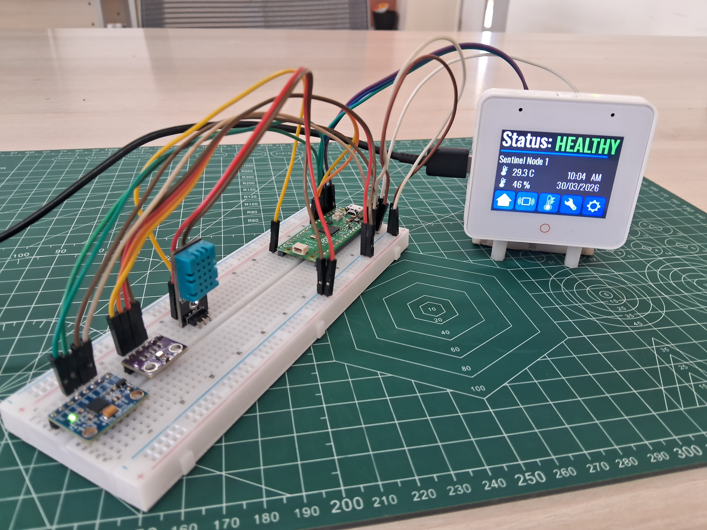
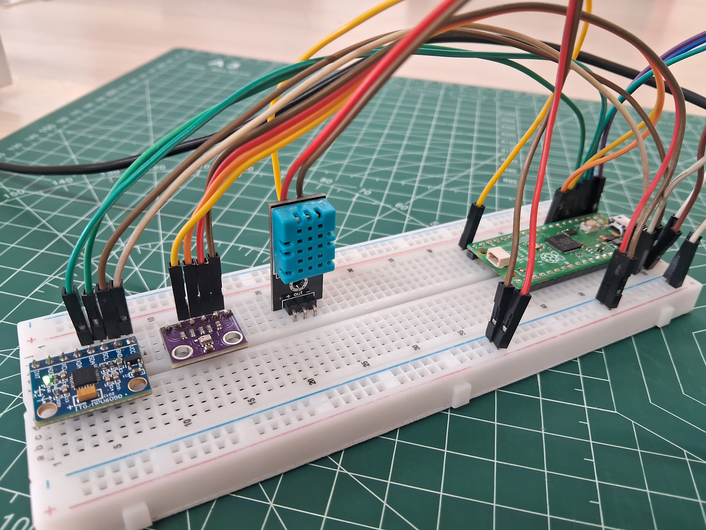
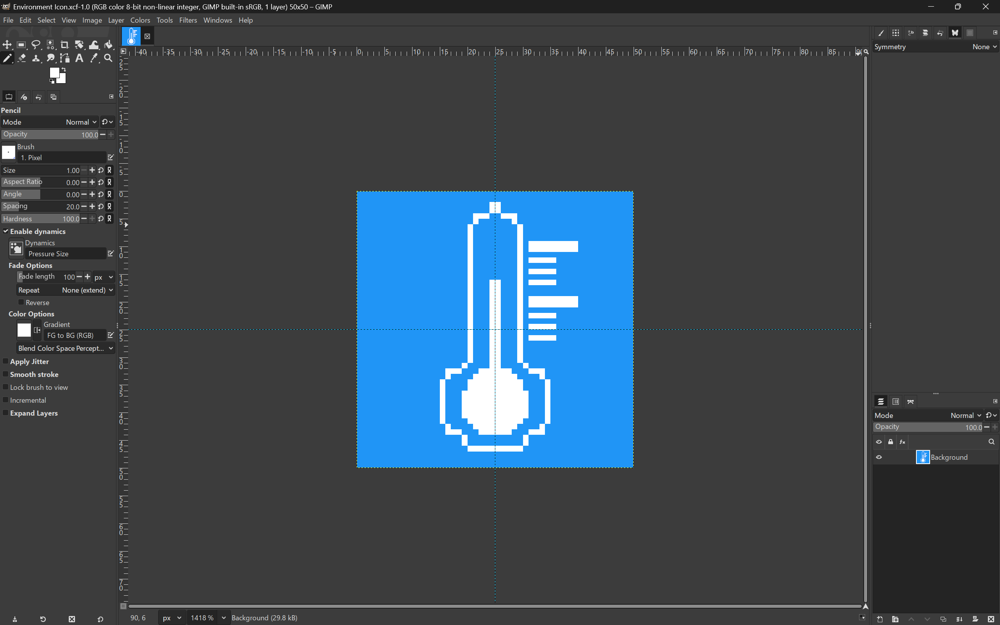
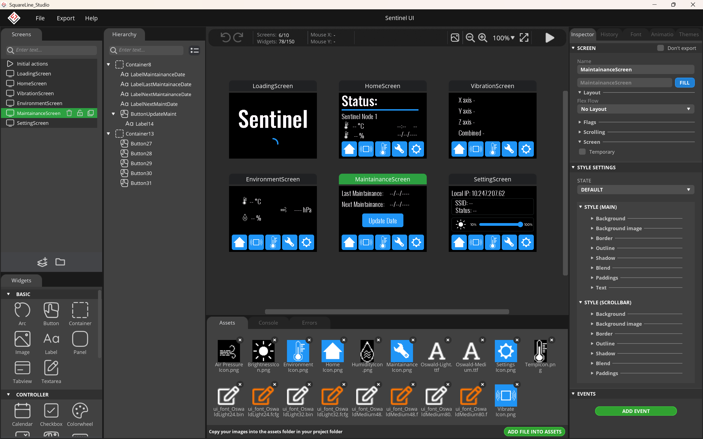
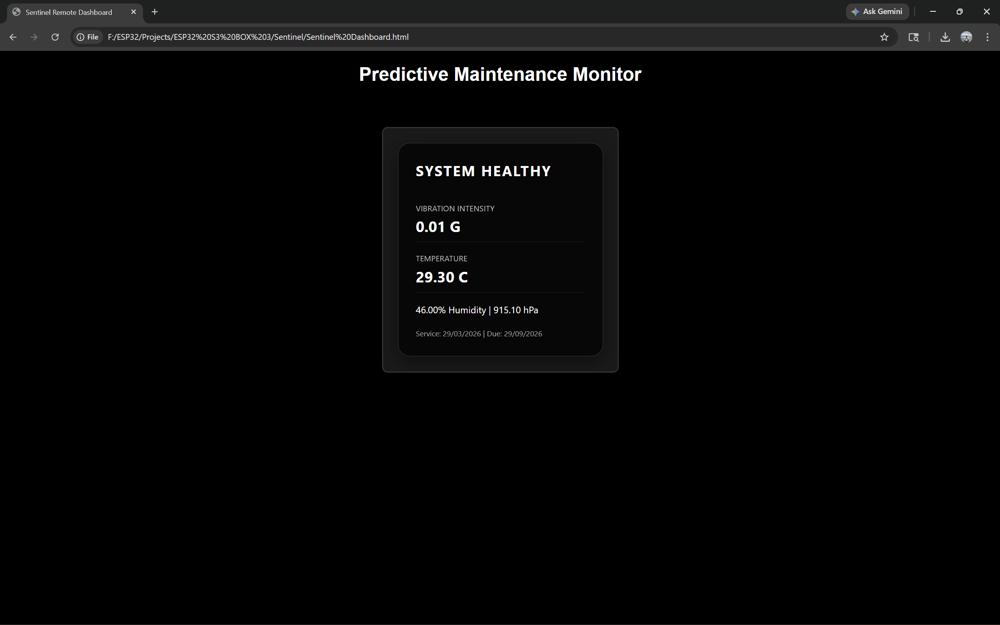
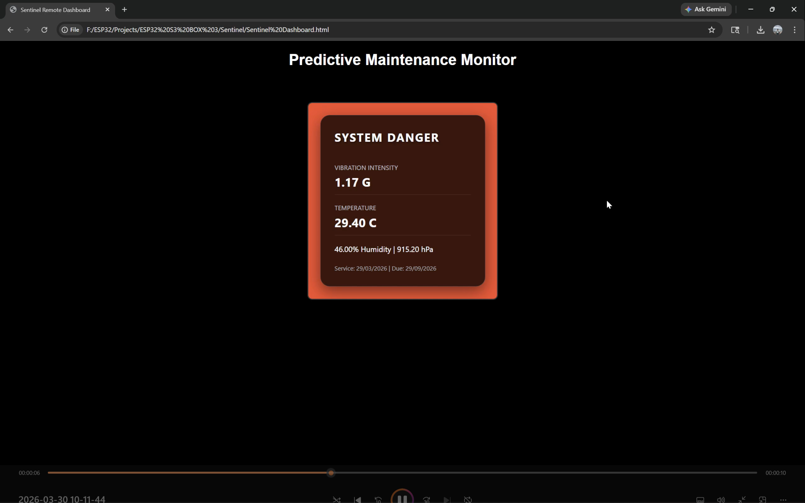
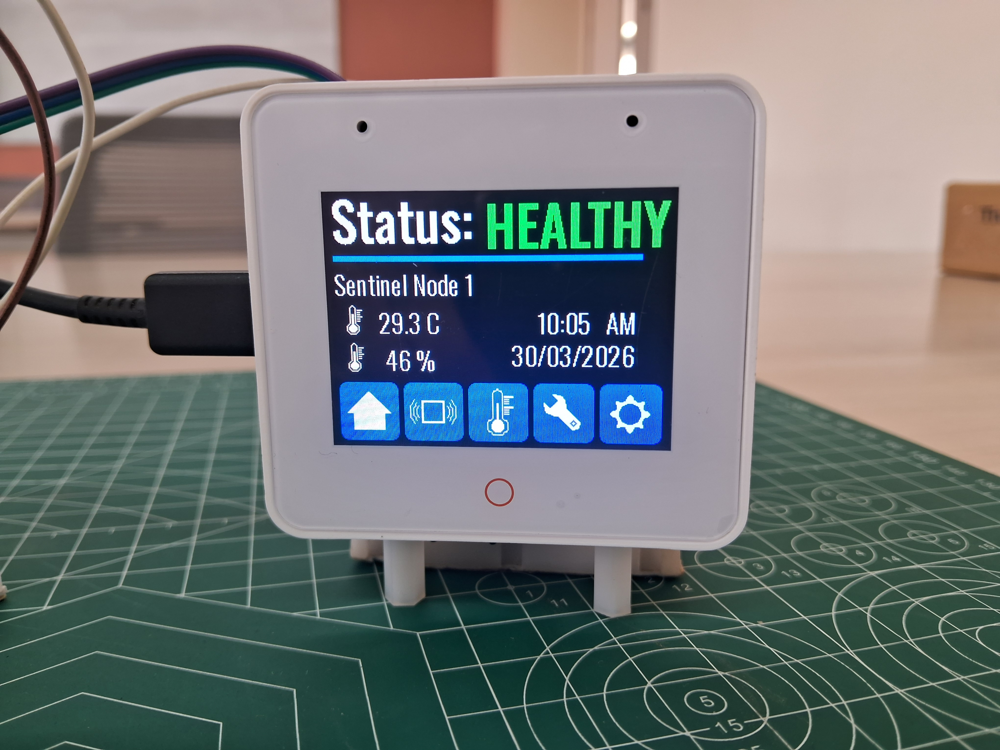

# Sentinel: Industry 4.0 Smart Monitoring Node



[](https://www.gnu.org/licenses/gpl-3.0)
[](https://github.com/espressif/esp-box/blob/master/docs/hardware_overview/esp32_s3_box_3/hardware_overview_for_box_3.md)

## Problem Statement Analysis
In modern industrial environments, the "health" of a machine is often invisible until a catastrophic failure occurs. While many IoT solutions attempt to provide predictive maintenance, they frequently suffer from two critical flaws: Hardware Overload and Data Noise. Standard single-chip monitoring systems often crash or experience significant latency when trying to manage high-resolution displays, WiFi stacks, and precise sensor acquisition simultaneously. This leads to "blind spots" where transient mechanical faults are missed. Furthermore, raw accelerometer data is inherently biased by Earth's gravity, making it difficult to isolate true mechanical vibration from the static orientation of the sensor without complex, manual calibration. Finally, many low-cost monitors lack data persistence, meaning service records and next-maintenance schedules are lost every time the power is cycled.

## Project Description: The Sentinel Hub
The Sentinel Predictive Maintenance Hub is a monitoring ecosystem designed to bridge the gap between raw mechanical data and actionable industrial intelligence. Unlike traditional single-processor monitors, Sentinel utilizes a dual-node architecture: a Raspberry Pi Pico W serves as a dedicated Data Acquisition node, while an ESP32-S3-BOX-3 acts as the intelligent HMI (Human-Machine Interface) and Network Gateway.
The system performs sampling of tri-axis vibration, temperature, humidity, and atmospheric pressure. At its core, the project employs a Dynamic High-Pass Alpha Filter to digitally cancel out the effects of gravity, providing a pure "Linear G-Force" reading that reflects actual mechanical stress. Beyond local monitoring, the Sentinel Hub serves as a WiFi Gateway, hosting a responsive web dashboard that provides remote operators with real-time, color-coded status alerts. With integrated Non-Volatile Storage (NVS), it also functions as a persistent digital logbook, tracking maintenance cycles and service history even through power outages.

## Hardware Setup
This project utilizes a Distributed Computing Architecture, requiring the assembly of two distinct nodes: the **Intelligent HMI (ESP32-S3)** and the **Sensor DAQ Node (Pi Pico W)**.

### Assembly of the ESP32-S3-BOX-3 Part
The ESP32-S3-BOX-3 serves as the central hub. It handles the high-resolution display, WiFi stack, and the HTTP Web Server.


Connect the ESP32-S3-BOX-3's display module to the ESP32-S3-BOX-3's BREAD module.

### Assembly of the Pi Pico Part


The Raspberry Pi Pico W acts as the high-speed Data Acquisition (DAQ) node. It is responsible for sampling the sensor array and performing required functions to collect and process the data.

**Vibration Sensor (MPU6050)**: 
Use the dedicated I2C Bus 1 (GPIO 2 - SDA, GPIO 3 - SCL) for maximum isolation.
                    
      Connect SDA to GPIO 2 and SCL to GPIO 3.
**Environment Sensors (BMP280 & DHT11)**: 
Use the I2C Bus 0 (GPIO 4 - SDA, GPIO 5 - SCL) 
                    
      for the BMP280: SDA to GPIO 4 and SCL to GPIO 5.
      Connect the DHT11 Data Pin to GPIO 15.

Connect the power of each sensor pin to the 3V3 Out and GND pins of the pico.

Mechanical Mounting: **The MPU6050 must be securely mounted to the machinery being monitored.**
The High-Pass Alpha Filter logic assumes the sensor is rigidly attached to the vibration source to ensure Signal Integrity.

### Connecting the two parts (ESP32 - Pico)
UART Connectivity: Connect the communication lines.
      
      RXD1 (GPIO 40): Connect to the Pi Pico TX (GP0).
      TXD1 (GPIO 41): Connect to the Pi Pico RX (GP1).
      
**Power Distribution**: To ensure WiFi stability and prevent brownouts:
Connect the 3V3 Out pin of the ESP32 to the VBUS pin of the Pi Pico, that is the pico will be powered by the ESP32.
Ensure a Common Ground (GND) is established between both boards.
HMI Mounting: Ensure the BOX-3 is oriented for easy viewing, as it will provide the primary Real-Time Health Status and NTP-synced clock display.

## UI/UX Design & Visual Assets
The visual identity and user interface of the Sentinel Hub were engineered to prioritize readability and operator speed. In an industrial setting, every second counts, so the design focuses on delivering high-contrast, "at-a-glance" information.

### Pixel Art Asset Creation in GIMP


To maintain a clean, technical aesthetic that consumes minimal memory on the ESP32, all logos and branding elements were custom-designed as Pixel Art.

Using GIMP (GNU Image Manipulation Program), icons were created at specific resolutions (e.g., 50x50) to ensure they remained sharp on the BOX-3’s display without anti-aliasing blur. By working at the pixel level, we ensured that the Sentinel branding and status indicators were visually distinct even when viewed from a distance or in low-light factory conditions. These assets were exported as regular .png images to optimize the UI.

### UI Development with SquareLine Studio



The core interface was architected using SquareLine Studio, a powerful visual tool for the LVGL (Light and Versatile Graphics Library).

The design utilizes a User-Centric (UX) approach, featuring:
1. Intuitive Layouts: A variety of interactive buttons and sliders (such as the real-time brightness control) that is easy to use.
2. Descriptive Labels: Every data point is accompanied by well-defined labels and units (e.g. "hPa", "°C") to eliminate ambiguity during high-stress monitoring.
3. Universal Iconography: By using standardized industrial icons, the UI transcends language barriers, allowing any worker to immediately recognize temperature, vibration, or humidity levels.

Rapid Fault Detection: The UI logic is tied directly to the sensor stream. If the machine deviates from its baseline, the status labels and web server background change color instantly. This allows workers to understand within a fraction of a second if the machine is functioning abnormally, facilitating an immediate safety response.


### **Critical Setup Note**
To match the UI design, you must **delete** the default `lvgl`, `ui` folders, and `lv_conf.h` from your `Documents\Arduino\libraries\` directory. **Extract** all the files and folders provided in this Zip file `Files_To_Copy.zip`. Copy all the `lvgl`, `ui` folders, and `lv_conf.h` from this zip file at `Documents\Arduino\libraries\` directory.

If you wish to modify the UI, extract all files in `Sentinel_Design_Files.zip`, and then import the project (.spj) file located in the extracted folder using SquareLine Studio. Make the desired changes, followed by using `Create template button` in Squareline Studio and save this template at the desired location. Further the orignal  `lvgl`, `ui` folders, and `lv_conf.h` from your `Documents\Arduino\libraries\` directory should be replaced by  the new `lvgl`, `ui` folders, and `lv_conf.h` from the library folder of your saved location.

## Software Development & Programming
The software for both nodes in the Sentinel Hub was developed using the Arduino IDE, leveraging its vast ecosystem of libraries to manage high-speed data streams and complex graphical rendering.

### Part 1: Coding the ESP32-S3-BOX-3 (Sentinel_ESP32.ino)
The central HMI node is programmed via the **Sentinel_ESP32.ino sketch**. This part of the system manages the LVGL graphics engine, handles WiFi connectivity, and serves the HTTP Web Dashboard.

Required Manual Libraries:
To compile this code, the following libraries must be installed manually via the Arduino Library Manager:

1. **LVGL (v8.3.11)**: Authored by kisvegabor. This is the core graphics library.
2. **ESP_Display_Panel**: Authored by Espressif Systems. This provides the hardware-specific drivers for the BOX-3 integrated display.

### **Configuration**
Update your WiFi credentials in the main firmware:
```cpp
const char* ssid     = "";
const char* password = "";
configTime(19800, 0, "pool.ntp.org");
```

Folder Structure: You must copy the entire folder named Sentinel_ESP to your local directory. This folder contains the main .ino file along with the ui.h, lvgl_v8_port.h and other important files.
Board Support: Ensure you have the latest ESP32 Board Library installed in your IDE.
IDE Settings: In the Arduino IDE, select the board as ESP32S3 Box. While the "Box 3" specific definition might not be visible in all versions, selecting the standard ESP32S3 Box works perfectly for this hardware without any compatibility issues.

### Part 2: Coding the Pico DAQ Node (Sentinel_Pico.ino)
The high-speed sensor acquisition is handled by the Sentinel_Pico.ino sketch. This code is optimized for Digital Signal Processing (DSP) and Serial Data Streaming.

Core & Environment:
This node requires the **Earle Philhower Pico Core for RP2040 support**.

You can follow my detailed tutorial on setting up this core here: <a href = "https://projecthub.arduino.cc/angadiameya007/getting-started-with-raspberry-pi-pico-in-arduino-ide-5e13ee">Getting Started with Raspberry Pi Pico in Arduino IDE. </a>

Required Manual Libraries:
The following libraries by Adafruit Industries must be installed manually. Please ensure you select "Install All Dependencies" when prompted:

**DHT Sensor Library**: Used for the DHT11 temperature and humidity data.

**Adafruit BMP280 Library**: Used for high-precision atmospheric pressure readings.

**Adafruit MPU6050**: Used for the tri-axis accelerometer and vibration monitoring.

**Adafruit Unified Sensor**: A required base dependency for the sensors above.

By offloading these sensor tasks to the Pi Pico, we ensure that the ESP32-S3 remains completely responsive for user interaction and network requests, preventing the system "hangs" common in single-processor designs.

## Remote Monitoring & Web Integration
The Sentinel Hub extends its functionality beyond the physical device by acting as a WiFi Gateway. This allows for remote, real-time monitoring of industrial assets from any workstation on the same network.

### Web Server Implementation



The ESP32-S3-BOX-3 hosts a built-in HTTP Web Server. While the internal display updates at a lightning-fast rate, the web server is optimized to serve a Minimalist Dashboard designed for remote oversight.

High-Frequency Data Refresh: The internal web state is updated every 50ms to match the Pico’s vibration stream, ensuring that the data served is always current.

Context-Aware Visual Alerts: The web server utilizes Dynamic CSS. Depending on the health status, the background color of the dashboard automatically transitions between Industrial Gray (Healthy), Safety Orange (Caution), and Vibrant Red (Danger). This creates a highly visible remote alarm system.

Low-Latency Communication: By utilizing a lightweight HTML structure, the server minimizes the processing load on the ESP32, ensuring that serving web requests never interferes with the critical LVGL UI rendering or UART data parsing.

### Local HTML Dashboard


To facilitate a professional monitoring station, a Local HTML File was developed to act as the primary interface for PC-based operators.

**Iframe Integration**: The local file uses an HTML Iframe to pull the live sensor data directly from the ESP32’s IP address. If needed open this file to edit the local IP of the ESP32 here. This method allows us to add multiple Sentinel nodes on a single screen thsu making monitoring very easy.

**Auto-Sync Logic**: A custom JavaScript loop was implemented to refresh the data every 500 milliseconds. This allows for a steady, reliable stream of telemetry on the computer screen without overwhelming the network bandwidth.

**UX Continuity**: The remote dashboard mirrors the essential data from the physical BOX-3 screen, including Vibration Magnitude, Temperature, Atmospheric Pressure, and Maintenance Schedules, providing a unified experience for the worker.

The html code file is available with the name **"Sentinel Dashboard.html"**.

## Future Improvements
Looking ahead, the Sentinel Hub is designed to be an expandable platform for **Industrial IoT (IIoT)**. A primary next step is the **integration of an SD Card Module to enable Local Data Logging**, allowing for years of historical telemetry to be archived for audit and trend analysis. This **massive dataset** of vibration, temperature, and atmospheric pressure will serve as the **foundation for training Advanced AI Models**.

By utilizing Machine Learning frameworks like **TensorFlow Lite**, these models could run directly on the ESP32-S3 at the edge or on a **centralized Monitoring Laptop** to detect subtle patterns in mechanical wear that are invisible to static thresholds.

## Conclusion


The Sentinel Predictive Maintenance Hub represents a significant step forward in low-cost, high-reliability industrial monitoring. By moving away from traditional monolithic software designs and embracing a Distributed Computing Architecture, the project successfully solves the common issues of system latency and unexpected machine down-time.

Through the combination of High-Pass Alpha Filtering for gravity-free vibration sensing, Non-Volatile Storage for persistent service logging, and a Dual-Node WiFi Gateway, the Sentinel Hub provides a comprehensive solution for factories. It is more than just a sensor; it is an Intuitive HMI that empowers workers with the data they need to prevent failure before it happens. Whether viewed on the ESP32-S3-BOX-3 display or a remote web dashboard, Sentinel ensures that machine health is always visible, documented, and actionable.
